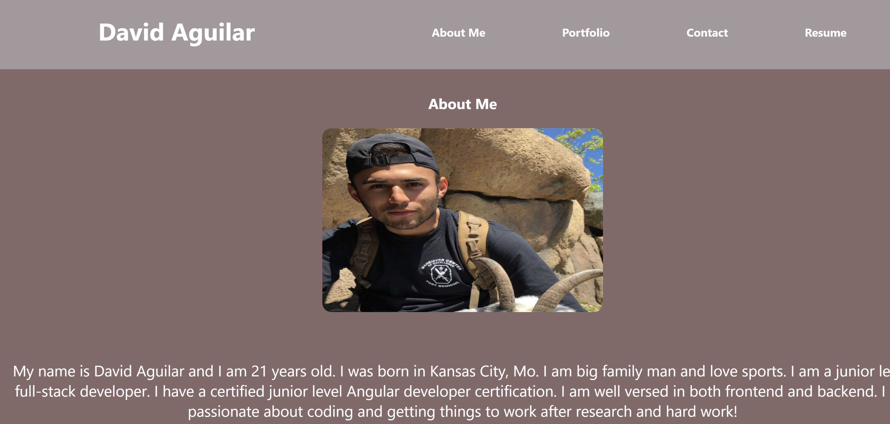

# react-portfolio

## Description 
I wanted to build an application that helps employers and users better understand who I am as a developer! This is a front end only application built using React.js. I chose to use this library to showcase my skills with a library like React. This app uses simple state manipulation to conditonally render different pages based on what a user clicks in the navigation. This site includes a portflio page where I showcase past projects I have completed. Enjoy my portfolio! 

### Application 

[Check out my portfolio!](http://davidjaguilar104.github.io/react-portfolio)

#### Technologies Used
* React
* JSX
* CSS
* JavaScript

